# STV & Qualtrics
Moving your online elections to a Single Transferable Voting system (sometimes called Ranked Candidate Voting) can be daunting. Thankfully, many universities have a license for the advanced survey software [Qualtrics](https://www.qualtrics.com "Qualtrics"). With the help of this tutorial and our Elections Tabulator, you will be able to roll out a complete STV solution for your campus/business/organization.

The first step is to log into your Qualtrics account.

Create a new project. Call it whatever you like. We just need a blank slate with which to play around.

The heart of STV is the ranking of candidates. There are two types of question types we can use to achieve this.

Create a new question. Make it of the type "Rank Order".

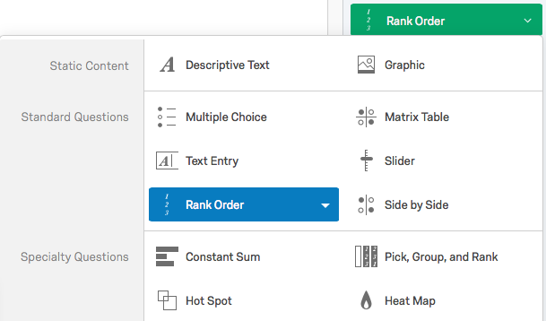

**Pros**:
- Logic is automatically handled by Qualtrics (so you can't rank two people #1 for example)
- Drag & Drop reordering

**Cons**:
- Drag & Drop reordering (if you have more than 5 candidates, it becomes a complete mess on mobile)
- Text entry ranking is slower and introduces increased possibility of user error

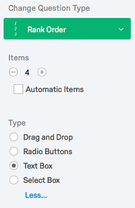

Give it 4 items/choices. Change the "Type" to "Text Box" for this example. I've found it works more universally than the other available options, but your experience may vary.

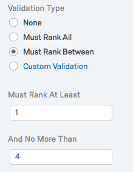

Validation for this type of question is simple. Change it to "Must Rank Between" with at least 1 and no more than 4. Qualtrics is smart enough to know it can only be numerals.

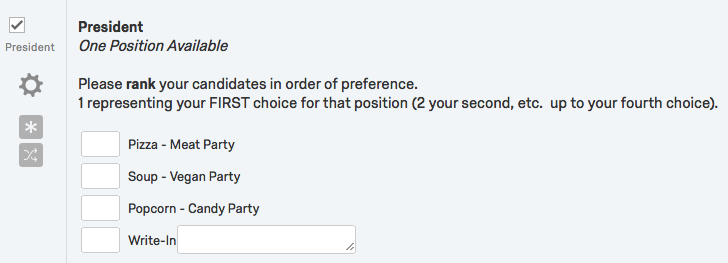

This is what it should look like when we're done with it (after randomization, which we'll go over soon). Change Q1 or Q2 or whatever is in the upper left corner to "President". Do the same for the title of the question. Add your own disclaimer and instructions about voting.

Give a name to your candidates (and add a party if needed). A write-in candidate isn't required, but it is fully supported (more on that later).

Now it's time for the alternative question type: "Matrix Table". This is, incidentally, what we use for all of our candidates at UCSB.

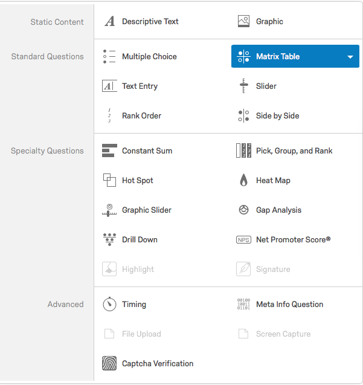

**Pros**:
- Versatility for user interfaces (dropdowns)
- Same numeric results as "Random Order"

**Cons**:
- Much more complicated validation rules

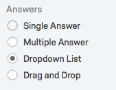

*Dropdown List* is the most user friendly option in our experience. A dropdown works to quickly select a candidate on both desktop and mobile. It also requires the least amount of effort for positions with lots of candidates (one of our positions has 13 openings and typically 30+ candidates in the running).

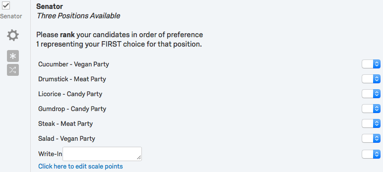

This is what things will look like. Change Qx in the upper left corner to "Senator". Do the same for the title of the question. Add your own disclaimer and instructions about voting. This question has 3 positions available (you can rank your #1, #2 and #3).

As above, give a name/party to your candidates .

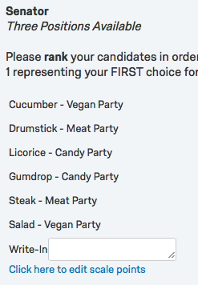

Time to edit the scale points (right there at the bottom).

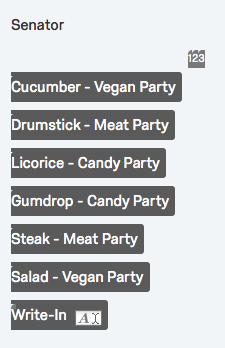

This one is simple. It's 1 2 3 (individually). Those are the choices the voters will be presented with when they select a candidate and rank them. Since the "Matrix Table" question isn't built for only a simple numeric ordering, we have to be explicit with these values.

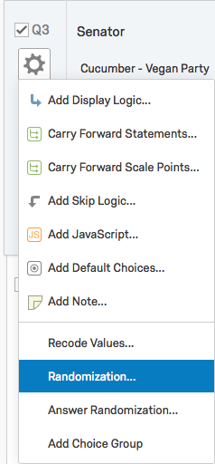

Our candidates have, for years, requested that their names appear in a random order on the ballot. This is simple with Qualtrics.

Select the gear icon next to each question. Pick "Randomization".

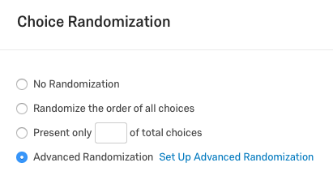

We're going for advanced (don't worry, it's not that advanced).

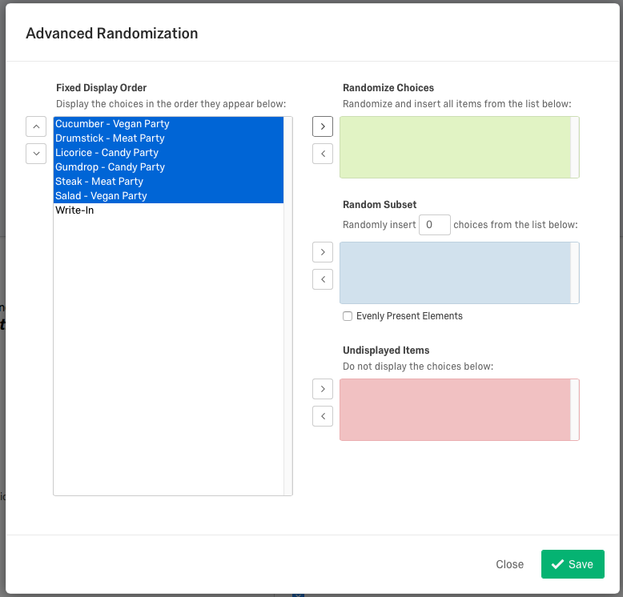

Select everyone but the "Write-In" and press the right arrow to send them into the green "Randomize Choices" box. That's it. If you don't have a write-in (or "none of the above") then just select "Randomize the order of all choices" instead of advanced above.

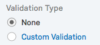

Validation is the tricky part with matrix tables. We can't have people selecting two #1s or a first choice, third choice and eighth choice but nobody in-between.

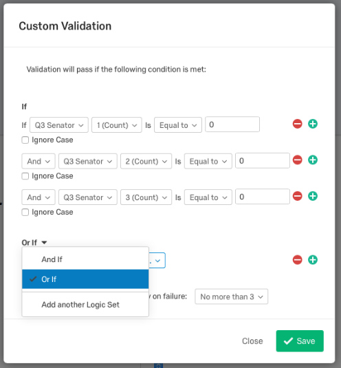

Bear with me. Things are about to get weird.

If you have three available rankings (as we do with the Senator position), your validation logic will look like this:

<pre>If
If Qx Senator 1(Count) is Equal to 0
And Qx Senator 2(Count) is Equal to 0
And Qx Senator 3(Count) is Equal to 0

Or If
If Qx Senator 1(Count) is Equal to 1
And Qx Senator 2(Count) is Equal to 0
And Qx Senator 3(Count) is Equal to 0

Or If
If Qx Senator 1(Count) is Equal to 1
And Qx Senator 2(Count) is Equal to 1
And Qx Senator 3(Count) is Equal to 0

Or If
If Qx Senator 1(Count) is Equal to 1
And Qx Senator 2(Count) is Equal to 1
And Qx Senator 3(Count) is Equal to 1

Then display error.
</pre>

This prevents voters from selecting more than one selection for a specific number (1 count, 2 count, 3 count) as well as preventing them from ranking candidates out of order. This scales easily up and down. It will just take a long while to write out all that logic for a ranking of 1-13.

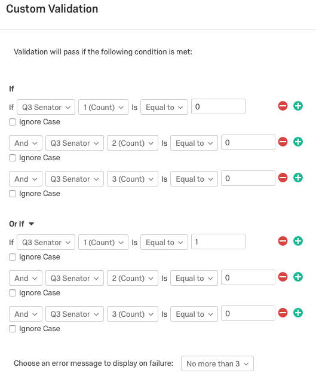

Each of those sections are another "Logic Set" that you need to add (with the "Or If" selection).

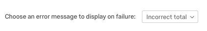

Create a new error message ("Incorrect Total" in the screenshot) to display if the voter violates this validation. Ours is in red.

## Cleanup

Select randomization options for both questions. Fix up any typos, double check your validation logic, etc.

Your ballot is done. Test it out to make sure the validation works and that it behaves as expected. Make your final tweaks and lock it. Take the survey a few times so that you have some test results.

## Export

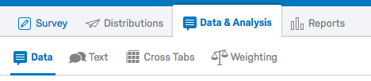
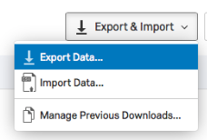

Now we'll be exporting the data in a format the tabulator can read. Goto "Data & Analysis : Data" and select "Export Data".

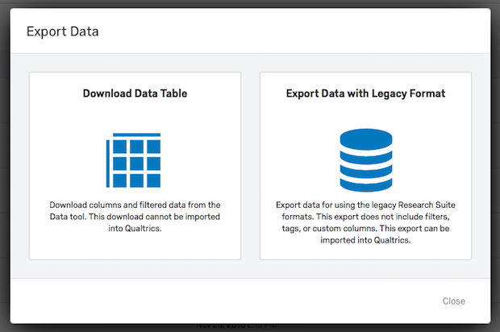

We want "Download Data Table" on the left.

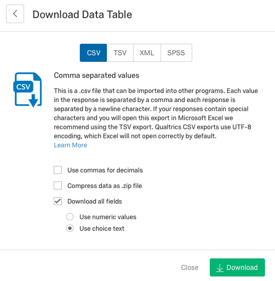

We want a CSV with "Download All Fields" and "Use choice text" selected. This is the final step from within Qualtrics. Now it's time to move onto Excel (or Numbers or Sheets or whatever spreadsheet editor you like that handles unicode well).

## Massaging the Data

We've included several sample results from various elections in this project. The one for the ballot we just created is within this qualtrics directory and under /results.

*stv-software-raw.csv* is how the file will come out straight from Qualtrics.

This test election had 46 replies to our two questions. Not very good turnout, but the show must go on. Open this file and follow along for a quick tutorial on how to get your data ready for import.

Much of the data is superfluous for our election needs. The first column we want to keep is "recordid/Response ID". Everything before that should be deleted. Next, remove column "Recipient Last Name" up to and including "Distribution Channel". Finally, remove the very last column called: "Q3_7_Text - Topics". We're not sure what that column is for.

Halfway there.

The votes consist of rows of numbers (1 2 3 or 4 for President. 1 2 or 3 for Senator). Plus the column for write-in candidate names. Find the first column of choices. "QID2_1" is the header.

Change all "Q1D2xxx" headers to "President". There are 5 of them. 3 are candidates, 1 is the ranking for a write-in, and 1 is the write-in's name.

Change all "Q1D3xxx" headers to "Senator".

The next row is the name of the candidates prepended by the name of the position and an incrementing numeral. Remove the text before all the candidate names. For example:

<pre>
President_1 - Pizza - Meat Party  >>  Pizza - Meat Party
President_4 - Write-In  >>  Write-In
</pre>

The only one that changes in an odd way is:
<pre>
President_4_TEXT - Write-In >> Write-In-TEXT
</pre>

Do that for all the positions. Save the file as a CSV and you're done.

Compare it to the *stv-software-clean.csv* file included in the qualtrics/results directory. Hopefully it matches.

## The Tabulator

It's finally time to use our beautiful piece of software to figure out who won this epic food election.

First up...

### Parsing & Configuration

Woooo! Parsing!

In order for the tabulator to interpret your results correctly, it must understand how to parse it. We have included parsing & configuration templates for both UC Berkeley and UC Santa Barbara. The configuration file contains information about what positions are titled, how many people are elected to each office, and how many write-in openings there are.

Look at the qualtrics/config-parser directory. The **configuration.json** file is what we care about.

Here it is in its entirety:

<pre>
{
  "general": {
    "default_speed": 50,
    "parser_directory": "./parser/",
    "candidate_parser": "ElectionCandidateParser",
    "ballot_parser": "ElectionBallotParser"
  },
  "races": [
    {
      "race_id": "race_president",
      "race_position": "President",
      "race_max_winners": 1,
      "race_extended_data": {
        "parser_group": "President",
        "parser_writein_fields": 1,
        "parser_writein_whitelist": ["Cheese"],
        "display_order": 2
      }
    },
    {
      "race_id": "race_senate",
      "race_position": "Senators",
      "race_max_winners": 3,
      "race_extended_data": {
        "parser_group": "Senator",
        "parser_writein_fields": 1,
        "parser_writein_whitelist": ["Ramen"],
        "display_order": 1
      }
    }
  ]
}
</pre>

Let's break down the variables that matter:

**default_speed** - How quickly the tabulator will churn through the results and display them. For dramatic purposes you might want this somewhere lower on the scale of 1-100.

**race_id** - A simple, no spaces and no uppercase title for the race. race_president, race_senator, race_queen, etc.

**race_position** - The title of the position. Feel free to use caps and spaces.

**race_max_winners** - How many positions are open? For President here, it's only 1. But there are 3 seats for Senator available.

**parser_group** - Sometimes identical to "race_position". This needs to be the same as the header for that position in the results file we cleaned up earlier. If you replaced all that Qualtrics stuff with "Senator", then that's what you should put here.

**parser_writein_fields** - How many write-in fields are included in this position? If zero, you can remove this line entirely.

**parser_writein_whitelist** - For UCSB elections, not all write-in candidates are created equal. They have to register as a candidate before the election begins. Therefore, only the names written here (separated by a comma) are counted in the totals.

`Note: If you have a legitimate write-in candidate, you will need to manually correct all the misspellings in the results file. Sorry.`

**display_order** - #1 being first. For dramatic purposes, we put the President position last.

Clear? Great.

### Loading it Up

Time to open up the tabulator. The readme file included with the tabulator should show you what software is required and how to start things up. Once the application is open, you will see:

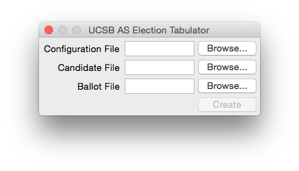

Browse for the configuration file we just went over. Select it.

For the "candidate file", select the results file **stv-software-clean.csv** we supplied for you. Choose the exact same file for the "ballot file".

`Note: The separation between candidate and ballot files due to compatibility with the UC Berkeley results. Qualtrics has no such separation.`

Click Create.

### Getting Results

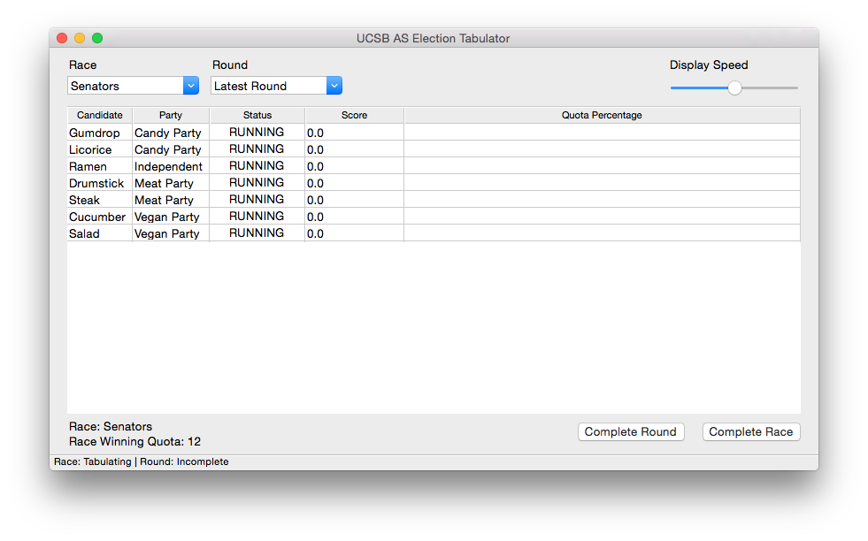

Do you see this? Fantastic.

"Complete Round" takes you through step by step (round by round). This is the dramatic way to do things.

The first round will show you all the first choice votes (and, in this election, our write-in candidate "Ramen" has already been eliminated and their 1 vote about to be redistributed).

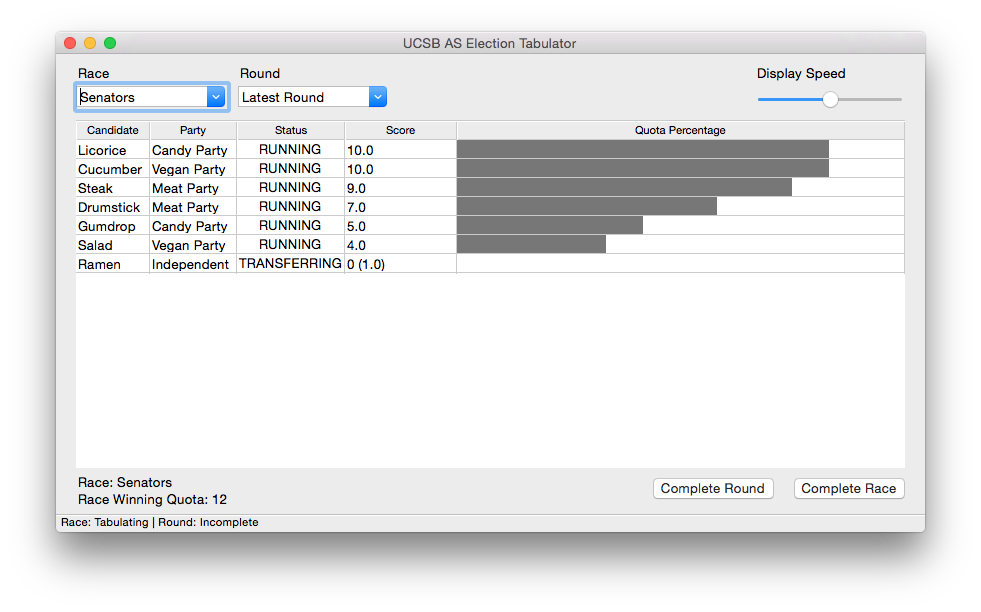

Continue through these rounds. During a round where a candidate does not meet the Droop Quota (lower left corner), the lowest vote getter is eliminated and their votes distributed to their next available choices. During a round where a candidate is elected, their excess votes are redistributed to their next available choices.

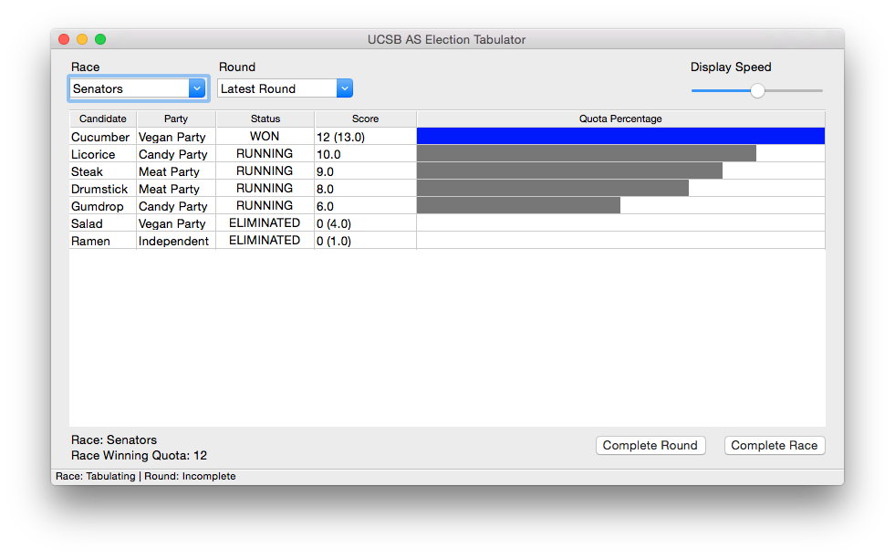

Cucumber is a winner. They have 1 excess vote (13 when all they needed was 12) that will be redistributed using some fun math that the software handles automagically (watch all the fractional votes tally up).

This process continues until all 3 positions have been filled.

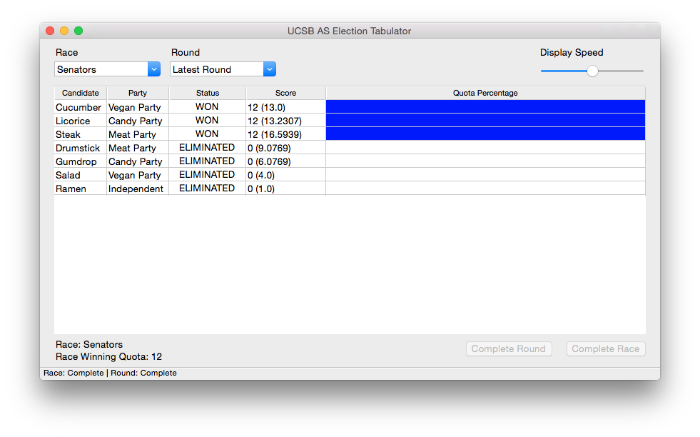

Looks like all three parties will be represented in this year's food senate.

Simply change the Race in the upper left corner to move onto the next one. Complete your rounds and you're done.

## Conclusion

For more information on STV and the processes we use, here are some good resources:

STV: [Wikipedia](https://en.wikipedia.org/wiki/Single_transferable_vote "STV"), [Video Explanation](https://www.youtube.com/watch?v=l8XOZJkozfI "Animal Kingdom"), [How it Works Video](http://www.fairvote.org/rcv#how_rcv_works "Fairvote Video")

Droop Quota: [Wikipedia](https://en.wikipedia.org/wiki/Droop_quota "Droop Quota")

Scottish Method: [Geeky Analysis](http://www.cne-siar.gov.uk/electionoffice/lge2012/documents/nominationpack/8%20Detailed%20Description%20of%20STV%20Count.pdf "Deep Analysis")

Any questions?

Feel free to [Contact Us](https://www.as.ucsb.edu/stv-contact/ "Contact Us").
